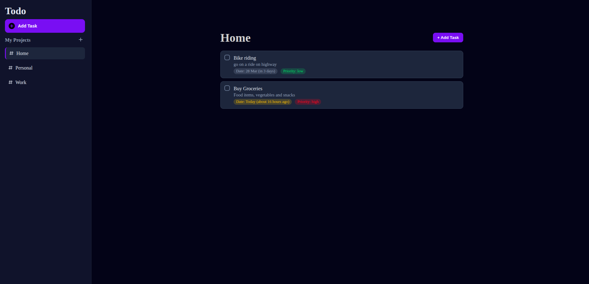

# Todo App 


[](https://wolfieslab.github.io/Todo-app/)

A simple and modular **Todo List web application** built with **Vanilla JavaScript, HTML, and CSS**.  
This project allows users to organize tasks into projects, manage deadlines, set priorities, and persist data using **Local Storage**.

This project was built as part of my journey learning **modern JavaScript development and application architecture**.

## Live Demo

Try the app here:
👉 https://wolfieslab.github.io/Todo-app/

## Highlights

- Project-based task organization
- Task priorities and due dates
- Smart due date formatting using date-fns
- Persistent data with localStorage
- Modular JavaScript architecture

## Screenshots

### Main Dashboard


## Features

### Project Management
- Create multiple projects to organize tasks
- Switch between projects from the sidebar
- Delete projects when they are no longer needed

### Task Management
- Add tasks with title and description
- Edit existing tasks
- Delete tasks
- Mark tasks as completed with a checkbox

### Task Details
Each task supports:
- Due date selection
- Priority levels (Low, Medium, High)
- Description field for additional notes
- Assignment to specific projects

### Smart Date Handling
The app uses **date-fns** to display helpful due date information:
- Shows **Today** for tasks due today
- Shows **Tomorrow** for upcoming tasks
- Marks **Overdue** tasks automatically
- Displays relative time (e.g., *in 3 days*, *2 days ago*)

### Persistent Storage
- Application state is automatically saved using **Local Storage**
- Tasks and projects remain available after refreshing the page

### Modular Architecture
The application follows a modular structure for maintainability:

- **Models** → Todo and Project data structures
- **Controller** → Application state management
- **Storage** → Handles saving and loading from localStorage
- **UI Modules** → Rendering, modals, and event handlers

This separation improves scalability and code readability.


## Technologies Used

- **JavaScript (ES6 Modules)**
- **HTML5**
- **CSS3**
- **date-fns** (for date formatting and relative time)
- **Local Storage API**


## Project Structure

```
src/
│ 
├── index.js
├── index.html
├── styles.css
├── modules/
│ ├── appController.js
│ ├── project.js
│ ├── todo.js
│ ├── storage.js
│ └── ui/
│  ├── render.js
│  ├── handlers.js
│  └── modal.js
├── resources/
│ ├── screenshots/
│  └── Todo-app.png
``` 


### Architecture

The app follows a **modular architecture**:

- **Models**
  - `project.js` → project logic
  - `todo.js` → todo data structure

- **Controller**
  - `appController.js` → application state management

- **Storage**
  - `storage.js` → handles saving and loading from localStorage

- **UI**
  - `render.js` → DOM rendering
  - `handlers.js` → event handlers
  - `modal.js` → modal forms for adding/editing tasks


## How It Works

1. Projects contain multiple todos.
2. Todos include:
   - Title
   - Description
   - Due Date
   - Priority
   - Completion status
3. When changes occur, the app:
   - Updates the UI
   - Saves the application state to **localStorage**
4. On page reload, the app restores the saved state.

## Prerequisites:
- Node.js
- npm

## Installation

1. Clone the repository:

    ```bash
    git clone https://github.com/wolfieslab/Todo-app.git
    ```

2. Navigate to the project folder:

    ```bash
    cd Todo-app
    ```
3. Install dependencies:

    This project uses date-fns for date formatting.

    ```
    npm install
    ```

4. Run the development server:

    If you are using a bundler like webpack or a dev server:
    ```
    npm start
    ```
5. Open in browser: 

    Visit:
    ```
    http://localhost:8080
    ```

## Future Improvements
- Task filtering (All / Today / Completed)
- Drag and drop tasks
- Mobile responsiveness
- Dark mode
- Task search
- Notifications for due tasks


## Key Learning Outcomes

While building this project, I practiced several important frontend development concepts:

### Modular JavaScript Architecture
- Organized the application using ES6 modules
- Separated concerns into **models, controller, storage, and UI modules**
- Improved maintainability and scalability of the codebase

### State Management
- Managed application state using a central **app controller**
- Ensured UI updates correctly when state changes

### DOM Manipulation
- Dynamically created and updated UI elements
- Implemented event-driven interactions for tasks and projects

### Data Persistence
- Implemented **localStorage** to save and restore the application state
- Ensured tasks and projects persist across browser sessions

### Working with External Libraries
- Used **date-fns** for date formatting and relative time calculations
- Implemented logic for detecting **today, tomorrow, and overdue tasks**

### UI Component Design
- Built reusable UI components such as:
  - Modal forms
  - Task rendering components
  - Sidebar project navigation

## Author

Sujal Sharma

GitHub:
https://github.com/wolfieslab

## License

This project is open source and available under the MIT License.